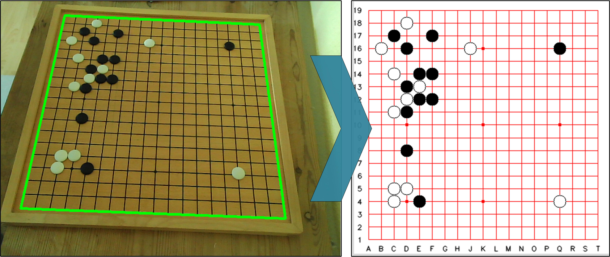

# PyGO

A Python utility to record your go games to sgf for studying games on real boards. Useable is any camera with sufficient image quality. For the best experience you want to use a tripod to place your camera next to the board in an elevated position.

## Installation
### From Github
Clone this environment to disk
```
git clone git@github.com:terminator-ger/PyGO.git
```
Download thirdparty libraries
```
bash ./install.sh
```
In your python environment run
```python
pip install -r requirements.txt
```

to install opencv_contrib_python, numpy, scipy, nptyping, scikit-image, sgfmill, playsound, pygobject

```python
python setup.py install
```

## Run PyGO
```python
python pygo.py 
```


## Known Limitations
- [x]  ~~Can not handle a moved board once position is detected~~
- [ ] determine min dist in get_corners based on image geometry
- [ ] currently only support 19x19

## Future Features
- [ ] katrain interface - live analysis of pysical games
- [ ] Timeline for videos
- [ ] backtracking of false/no detections
